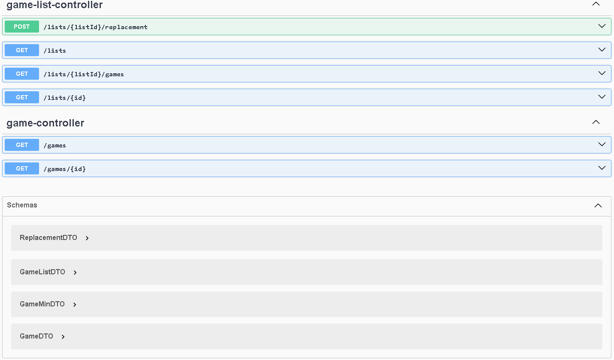

# DSList - Intensivão de Java Spring

## 🚧 Status

Este projeto está em andamento e será atualizado até o final do intensivo no dia **26/01/2025**.

🚀 **Repositório dedicado ao Intensivão de Java Spring com o professor Nélio Alves!**

Este projeto foi criado como parte de um programa intensivo para o aprendizado de desenvolvimento de APIs REST
utilizando **Java** e o **Spring Framework**.

## 📚 O que eu aprendi até agora:

- 🌐 **Conceitos básicos de sistemas web e recursos**
    - Cliente/servidor, HTTP, JSON.
- 📜 **Padrão REST para APIs Web**
- 🛠️ **Estruturação de projetos com Spring REST**
- 🗄️ **Trabalho com Entidades e ORM**
- 🌱 **Database seeding**
- 🏗️ **Padrão de camadas** (Controller, Service, Repository)
- ✉️ **Uso de DTO (Data Transfer Object)**
- 🔗 **Relacionamentos N-N**
- 📦 **Classe de associação e Embedded ID**
- 🔍 **Consultas SQL no Spring Data JPA**
- 🎯 **Projections**
- 🐳 **Ambiente local com Docker Compose**
- 🛠️ **Processo de homologação local**
- 📝 **Dicas de currículo e portfólio**
- 📂 **Perfis de projeto**
- 🚀 **Processo de deploy com CI/CD**
- 🔒 **Configuração de CORS**

## 📌 Objetivo do Projeto

Construir uma API RESTful funcional aplicando os conceitos de arquitetura, boas práticas e ferramentas do ecossistema
Java Spring.

## 🛠️ Tecnologias Utilizadas

- **Java**
- **Spring Boot**
- **Spring Data JPA**
- **H2 Database**
- **Postman** (para testes de API)

## 📝 Licença

Este projeto está sob a licença MIT. Sinta-se à vontade para usá-lo e contribuir!  
